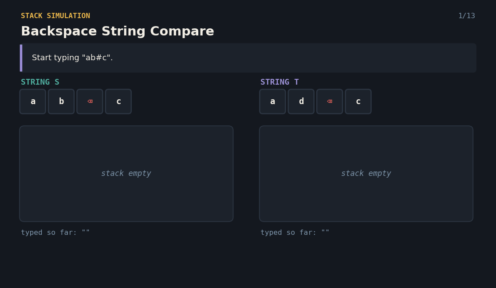
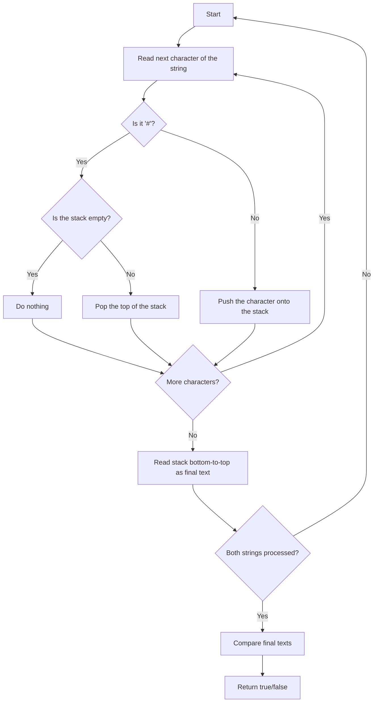

# Backspace String Compare — The Typing Stack

A Java solution to the **Backspace String Compare** problem, paired with an interactive React visualization that explains the stack technique to anyone — technical or not.

**Given two strings that may contain `#` (a backspace key), check if they end up equal after applying all the backspaces.**



---

## 📌 Problem Statement

You are given two strings made of lowercase letters and the character `#`, where `#` means "delete the previous character" (like pressing Backspace on a keyboard).

Apply the backspaces in both strings and check if the final typed text is identical.

**Example**
```
S: "ab#c"  →  type a, type b, backspace (removes b), type c  →  "ac"
T: "ad#c"  →  type a, type d, backspace (removes d), type c  →  "ac"

"ac" == "ac"  →  true
```

---

## 💡 Real-Life Analogy

Picture two people typing on old typewriters, each with a **pile of letter tiles** stacking up in front of them as they type.

- Typing a letter drops a new tile **on top** of their pile.
- Pressing `#` (backspace) **lifts the top tile off** the pile and throws it away — if the pile is already empty, nothing happens.

Once both people finish typing out their strings, you read each pile from bottom to top and compare the two piles. If the piles spell the same word, the strings are considered equal.

---

## 🧠 Core Idea

1. Go through the string **one character at a time**.
2. If it's a normal letter, **push it onto a stack** (type it).
3. If it's `#`, **pop the top of the stack** — but only if the stack isn't already empty (backspace).
4. After processing the whole string, the stack (bottom to top) is the final typed text.
5. Do this for **both strings**, then compare the two final results for equality.

A stack is the perfect fit here because backspace always removes the *most recently typed* character — exactly what "pop the top" does.

---

## 🔄 Algorithm Flow



---

## 💻 The Java Solution

```java
package Backspace_String_Compare;
import java.util.*;
public class Solution{

    static String removeHas(String s){
        Stack<Character> stack = new Stack<>();

        int i=0;
        while(i<s.length()){

            if(s.charAt(i)=='#'){
                if (!stack.isEmpty()) {
                    stack.pop();
                }
            }else{
                stack.push(s.charAt(i));
            }
            i++;
        }

        StringBuilder sb = new StringBuilder();

        for (char ch : stack) {
            sb.append(ch);
        }

        String result = sb.toString();
        return result;
    }
    public static void main(String[] args){

        String s="ab#c" ,t="ad#c";

        System.out.println(removeHas(s).equals(removeHas(t)));
    }
}
```

**Complexity**
- Time: `O(n + m)` — each string is scanned once, where `n` and `m` are the string lengths.
- Space: `O(n + m)` for the two stacks holding the final characters.

---

## 🎬 Interactive version

`BackspaceCompareVisualizer.jsx` renders both strings side by side as live typing stacks — letters drop onto the pile, `#` pops the top tile off, and a final comparison panel shows whether the two results match.

**Features**
- Type in your own strings for S and T (letters and `#` only)
- Step forward / backward, or press play to auto-advance
- Watch each stack build in real time, tile by tile
- Shuffle button for a random example

**Run it locally**
```bash
npm install lucide-react
```
```jsx
import BackspaceCompareVisualizer from "./BackspaceCompareVisualizer";

export default function App() {
  return <BackspaceCompareVisualizer />;
}
```

A ready-to-run CodeSandbox project (with `package.json`, `index.html`, `index.js`, `App.js` already wired up) is included as `backspace-compare-sandbox.zip` — unzip it, `npm install`, `npm start`, and it runs immediately.

---

## ✅ Why This Approach Works

- A **stack naturally models "undo the last action"** — which is exactly what backspace does.
- Checking `!stack.isEmpty()` before popping means extra backspaces (like `"###a"`) never crash or wrongly delete something that isn't there.
- Comparing the two final stacks handles every case — different backspace patterns can still land on the exact same final text.
