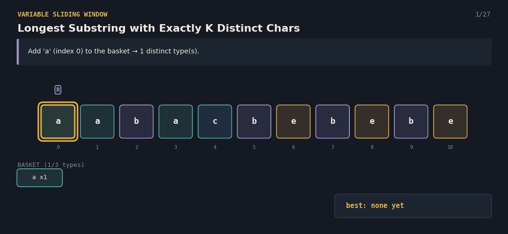
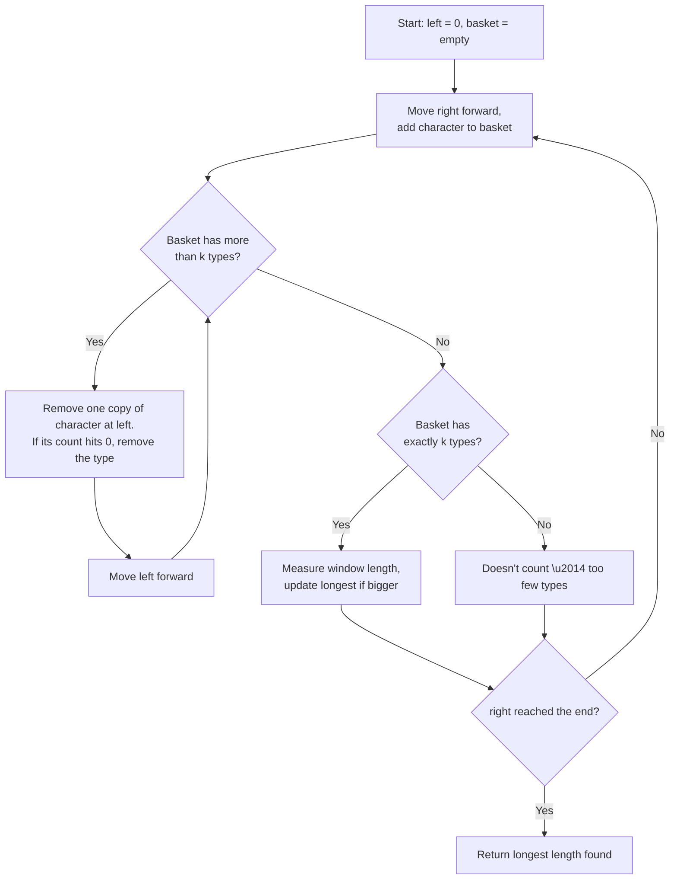

# Longest Substring with Exactly K Distinct Characters — The Fruit Basket

A Java solution to the **Longest Substring with Exactly K Distinct Characters** problem, paired with an interactive React visualization that explains the variable-size sliding window technique to anyone — technical or not.

**Given a string, find the length of the longest continuous stretch that contains exactly `k` different characters.**



---

## 📌 Problem Statement

You're given a string `s` and a number `k`. Find the length of the **longest contiguous substring** that contains **exactly `k` distinct characters** — not fewer, not more.

**Example**
```
String: "aabacbebebe", k = 3

Longest stretch with exactly 3 distinct characters: "cbebebe" (indices 4..10)
Distinct characters: {c, b, e} → exactly 3

Answer: 7
```

## 🧠 Core Idea

1. Use **two pointers**, `left` and `right`, and a running count of how many of each character is currently "in the basket" (the window).
2. **Expand** the window by moving `right` forward, adding the new character to the basket.
3. If the basket now holds **more than `k`** distinct types, **shrink from the left** — removing one copy of the character at `left` each time, and removing that type entirely from the basket once its count hits zero — until the basket is back to `k` or fewer types.
4. Whenever the basket holds **exactly `k`** types, measure the window's length and **keep the longest one seen**.
5. Continue until `right` reaches the end of the string.

The key difference from "at most k" problems: a window with *fewer* than `k` distinct characters is not a valid answer here, so only windows landing on exactly `k` are compared against the best length.

---

## 🔄 Algorithm Flow



---


**Complexity**
- Time: `O(n)` — `right` moves forward `n` times total, and `left` also moves forward at most `n` times total across the whole run.
- Space: `O(min(n, alphabet size))` for the character-count map.

**Note:** the function returns `-1` if the string never contains a window with exactly `k` distinct characters (for example, if the string has fewer than `k` distinct characters overall).

---
---

## ✅ Why This Approach Works

- The window **only ever shrinks as much as needed** — as soon as the basket drops to `k` types or fewer, it's safe to stop and keep expanding.
- Because `left` only ever moves forward, the total shrink work across the whole run is capped at `n`, keeping the algorithm linear.
- Checking for "exactly `k`" (rather than "at most `k`") after every valid expansion ensures windows with too few distinct characters are correctly excluded from the answer.
