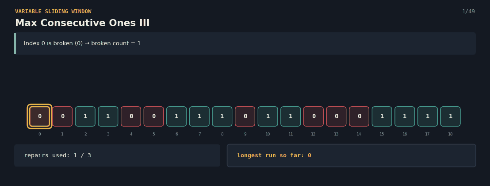
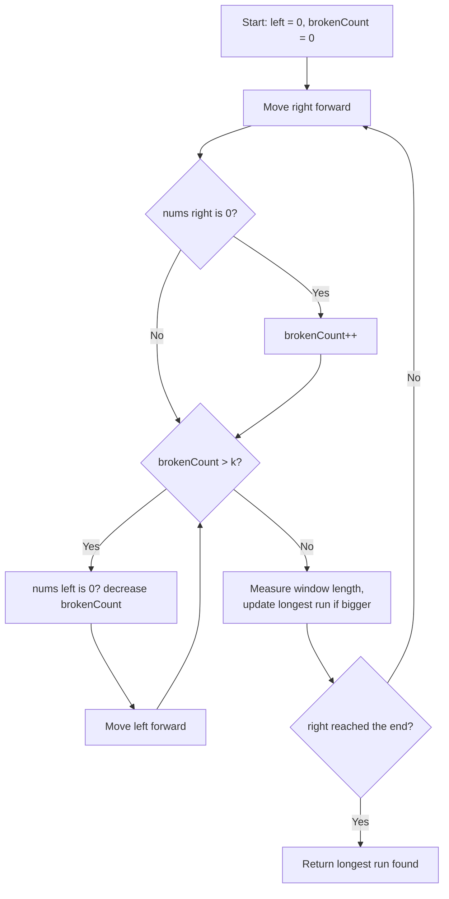

# Max Consecutive Ones III — The Streetlight Repair

A Java solution to the **Max Consecutive Ones III** problem, paired with an interactive React visualization that explains the variable-size sliding window technique to anyone — technical or not.

**Given a row of 0s and 1s, and a budget of `k` flips, find the longest stretch of 1s you can create by flipping at most `k` zeros.**


**click here 👇**

🔗 **[Try the live visualization](https://rxk97w.csb.app/)**




---

## 📌 Problem Statement

You're given a list made only of `0`s and `1`s, and a number `k`. You're allowed to flip **at most `k` zeros into ones**. Find the length of the **longest run of consecutive 1s** you can create.

**Example**
```
Array: [0,0,1,1,0,0,1,1,1,0,1,1,0,0,0,1,1,1,1], k = 3

Best stretch (flipping 3 zeros): indices 2..11
1,1,0,0,1,1,1,0,1,1 → flip the 3 zeros in this range → 10 ones in a row

Answer: 10
```


## 🧠 Core Idea

1. Use **two pointers**, `left` and `right`, marking a window — both start at the beginning.
2. **Expand** the window by moving `right` forward. If the number there is `0`, it costs one repair — increase the repair count.
3. If the repair count **exceeds `k`**, the window is invalid — **shrink from the left** (moving `left` forward, and reducing the repair count if the number leaving was a `0`) until it's valid again.
4. After every expansion (and any needed shrinking), measure the window's length and **keep the largest one seen**.
5. Continue until `right` reaches the end of the list.

Because the window only ever grows from the right and shrinks from the left — never resetting — every number is looked at a small, bounded number of times, keeping the whole scan fast.

---

## 🔄 Algorithm Flow



---

**Edge-case shortcut:** if `k` is at least as large as the whole array, every broken light could be repaired anyway, so the entire array is already the answer — `if (nums.length == k) return k;` catches this instantly without running the window at all.

**Complexity**
- Time: `O(n)` — `right` moves forward `n` times total, and `left` also moves forward at most `n` times total across the whole run (never backward).
- Space: `O(1)` extra — just a running repair count and a couple of index trackers.

---


## ✅ Why This Approach Works

- The window **never needs to shrink more than necessary** — as soon as the repair count drops back to `k` or below, it's safe to stop shrinking and keep expanding.
- Because `left` only ever moves forward (never resets to `0`), the total number of shrink steps across the entire run is capped at `n`, keeping the algorithm linear.
- Measuring the window length after every valid expansion guarantees the true longest run is found, without ever needing to re-check earlier windows.
