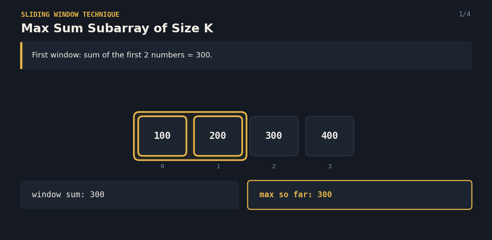
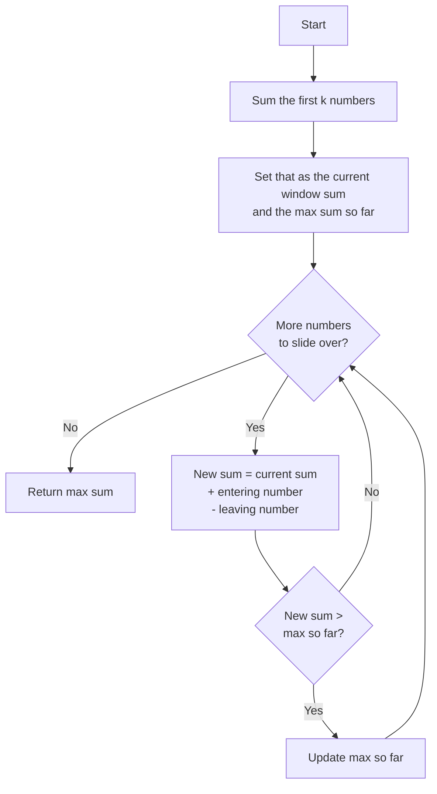

# Max Sum Subarray of Size K — The Sliding Window

A Java solution to the **Max Sum Subarray of Size K** problem, paired with an interactive React visualization that explains the sliding window technique to anyone — technical or not.

**Given a list of numbers and a fixed size K, find the maximum sum among all contiguous groups of K numbers.**



---

## 📌 Problem Statement

You're given a list of numbers and a number `k`. Look at every group of `k` numbers that sit **next to each other** in the list, add each group up, and report the **largest total** you can find.

**Example**
```
Array: [100, 200, 300, 400], k = 2

Groups of 2 neighbours:
[100,200] = 300
[200,300] = 500
[300,400] = 700   ← largest

Answer: 700
```

---

## 💡 Real-Life Analogy

Imagine a **picture frame of fixed width** sliding along a long wall covered in paintings, each painting tagged with a price.

You want to know: which stretch of `k` neighbouring paintings, framed together, has the **highest combined price**?

Instead of picking the frame up and re-adding every painting's price each time you move it, you do something smarter: slide the frame one painting to the right, **add the price of the painting that just came into view**, and **subtract the price of the painting that just left**. One quick update instead of starting over.

---

## 🧠 Core Idea

1. Add up the **first `k` numbers** — that's your starting window and your first "best so far."
2. **Slide the window one step to the right**: add the new number entering on the right, subtract the number leaving on the left.
3. If this new total beats the best so far, **update the best so far**.
4. Keep sliding until the window reaches the end of the list.
5. The best total you ever saw is the answer.

This avoids recomputing the sum of every group from scratch — each slide is just one addition and one subtraction, no matter how big `k` is.

---

## 🔄 Algorithm Flow



---

## 💻 The Java Solution

```java
package Max_Sum_Subarray_of_size_K;

public class Solution {
	public static int maxSumSubarray(int[] arr, int k) {
	    int windowSum=0;
		for(int i=0;i<k;i++){
			windowSum+=arr[i];
		}
		int prevSum=windowSum;
		int maxSum=windowSum;
		for(int i=k;i<arr.length;i++){
			prevSum=prevSum+arr[i]-arr[i-k];
			if(prevSum>maxSum) maxSum=prevSum;
		}
		return maxSum;
	}

	public static void main(String[] args) {
		int[] arr = {100, 200, 300, 400};
		System.out.println(maxSumSubarray(arr, 2)); 
	}
}
```

**Complexity**
- Time: `O(n)` — every number is added once (into the window) and subtracted once (as it leaves).
- Space: `O(1)` extra — just a couple of running totals, no matter how big the array or `k` is.

---

## 🎬 Interactive version

`SlidingWindowVisualizer.jsx` renders the algorithm as a window frame gliding across the array: the tiles inside the frame are highlighted gold, the entering value is marked in teal, the leaving value in crimson, and the running max updates live as it's beaten.

**Features**
- Type in your own array and `k`, or hit the shuffle icon for a random example
- Step forward / backward, or press play to auto-advance
- Live "window sum" and "max so far" readouts
- Visual entering/leaving markers on every slide

**Run it locally**
```bash
npm install lucide-react
```
```jsx
import SlidingWindowVisualizer from "./SlidingWindowVisualizer";

export default function App() {
  return <SlidingWindowVisualizer />;
}
```

A ready-to-run CodeSandbox project (with `package.json`, `index.html`, `index.js`, `App.js` already wired up) is included as `max-sum-subarray-sandbox.zip` — unzip it, `npm install`, `npm start`, and it runs immediately.

---

## ✅ Why This Approach Works

- **Every number is touched at most twice** — once when it enters the window, once when it leaves — instead of being re-summed for every possible group.
- The window always has a **fixed size**, so there's no need to track its boundaries beyond a single index sliding forward.
- Comparing against the running max after every slide guarantees the true best is found, without ever storing all the sums.
