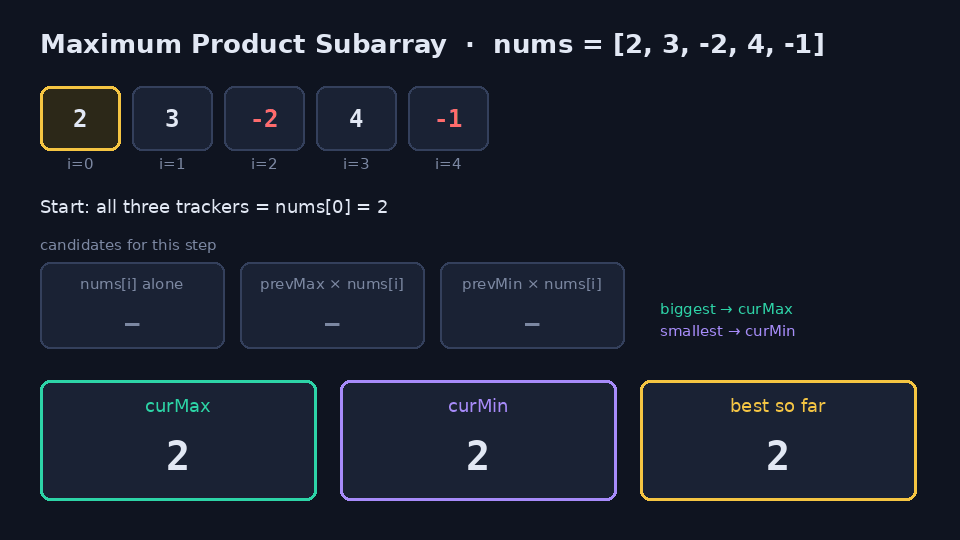
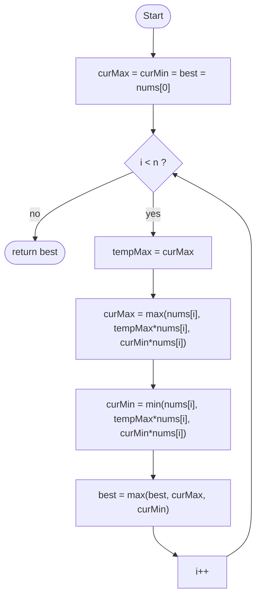

# Maximum Product Subarray (LeetCode 152)



## Problem

Given an integer array `nums`, find the contiguous subarray with the largest product and return that product.

```
Input:  nums = [2,3,-2,4]     Output: 6      ([2,3])
Input:  nums = [-2,0,-1]      Output: 0
```

## Analogy: two scoreboards

Imagine a game where you keep multiplying your score by each new card.
Positive cards grow it. A negative card **flips the sign**, so your worst score suddenly becomes your best.

So keep two scoreboards at every step:

- **curMax**: the biggest product of a subarray ending here
- **curMin**: the smallest (most negative) product of a subarray ending here

A deeply negative `curMin` is not a loss. One more negative number and it becomes the new maximum.

## Core idea

For each `nums[i]`, the best subarray ending at `i` is one of three things:

1. `nums[i]` alone (start fresh)
2. `prevMax * nums[i]`
3. `prevMin * nums[i]`

Take the largest as the new `curMax` and the smallest as the new `curMin`.
The answer is the largest value either tracker ever reaches.

The code saves `curMax` in `tempMax` before overwriting it, because `curMin` needs the **old** max.



## Java solution

```java
public static int maxProduct(int[] nums) {
    int currentProMax = nums[0];
    int currentProMin = nums[0];
    int maxProduct = nums[0];

    for (int i = 1; i < nums.length; i++) {
        int tempMax = currentProMax;
        currentProMax = Math.max(nums[i], Math.max(tempMax * nums[i], currentProMin * nums[i]));
        currentProMin = Math.min(nums[i], Math.min(tempMax * nums[i], currentProMin * nums[i]));
        maxProduct = Math.max(maxProduct, Math.max(currentProMax, currentProMin));
    }
    return maxProduct;
}
```

Full file: [`Solution.java`](./Solution.java)

## Trace on `[2,3,-2,4]`

| i | nums[i] | curMax | curMin | best |
|---|---------|--------|--------|------|
| 0 | 2  | 2  | 2   | 2 |
| 1 | 3  | 6  | 3   | 6 |
| 2 | -2 | -2 | -12 | 6 |
| 3 | 4  | 4  | -48 | 6 |

Result: **6**. The GIF uses `[2,3,-2,4,-1]` so you can watch `-48` flip to `48`.

## Complexity

- **Time:** O(n), one pass
- **Space:** O(1), three integers

Note: `int` can overflow on very long arrays with large values. LeetCode guarantees the answer fits in 32 bits.

## Interactive version

`MaxProductVisualizer.jsx` is a React component. Type your own array and step through it, or auto-play.

**Quickest way:** unzip `maxproduct-sandbox.zip`, then

```bash
npm install && npm start
```

Or upload the unzipped folder to [codesandbox.io](https://codesandbox.io) (Import project).
