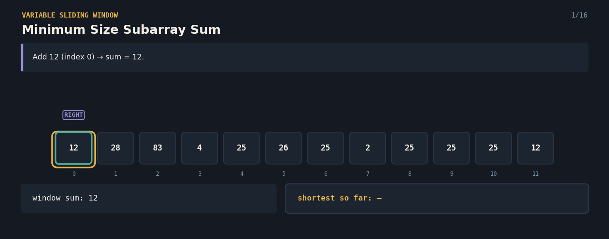
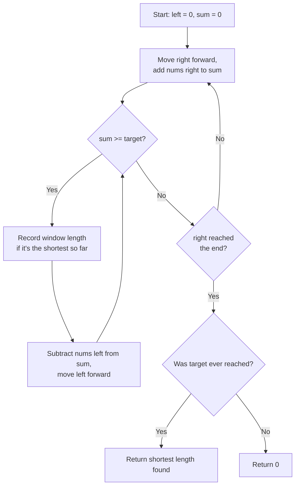

# Minimum Size Subarray Sum — The Shrinking Window

A Java solution to the **Minimum Size Subarray Sum** problem, paired with an interactive React visualization that explains the variable-size sliding window technique to anyone — technical or not.

**Given a list of numbers and a target total, find the length of the *shortest* contiguous stretch that adds up to at least the target.**

**click here 👇**

🔗 **[Try the live visualization](https://27jd7s.csb.app/)**




---

## 📌 Problem Statement

You're given a list of positive numbers and a `target` number. Find the length of the **shortest contiguous group** of numbers whose sum is **at least** the target. If no group ever reaches the target, the answer is `0`.

**Example**
```
Array: [12, 28, 83, 4, 25, 26, 25, 2, 25, 25, 25, 12], target = 213

Shortest stretch that sums to ≥ 213: indices 2..9
83 + 4 + 25 + 26 + 25 + 2 + 25 + 25 = 215  (length 8)

Answer: 8
```


## 🧠 Core Idea

1. Use **two pointers**, `left` and `right`, marking a window — both start at the beginning.
2. **Expand** the window by moving `right` forward, adding each new number to a running sum.
3. Whenever the running sum reaches the target, the window is a valid candidate — **record its length if it's the shortest seen so far**, then **shrink from the left** (removing the leftmost number, moving `left` forward) and check again, since a shorter valid window might still exist.
4. Keep expanding and shrinking until `right` reaches the end of the list.
5. The shortest valid window length ever recorded is the answer — or `0` if the target was never reached.

Because every number is only added once (when `right` passes it) and removed once (when `left` passes it), the whole scan happens in a single pass.

---

## 🔄 Algorithm Flow



---

**Complexity**
- Time: `O(n)` — `right` and `left` each move forward at most `n` times total, never backward.
- Space: `O(1)` extra — just a running sum and a couple of counters.

---
---

## ✅ Why This Approach Works

- **The window never needs to shrink past where it should** — since all numbers are positive, once the sum drops below target after removing the leftmost number, removing more would only make it smaller, so it's safe to stop and expand again.
- Every number enters the sum exactly once and leaves exactly once, so the total work stays linear — no re-scanning of the same numbers.
- Checking for a new "shortest so far" at every valid window guarantees the true minimum is found, without ever needing to store every valid window.
