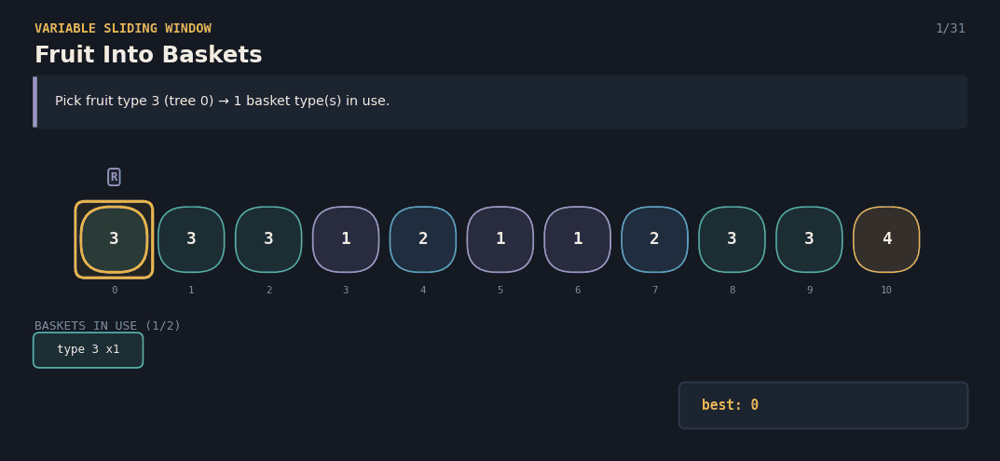
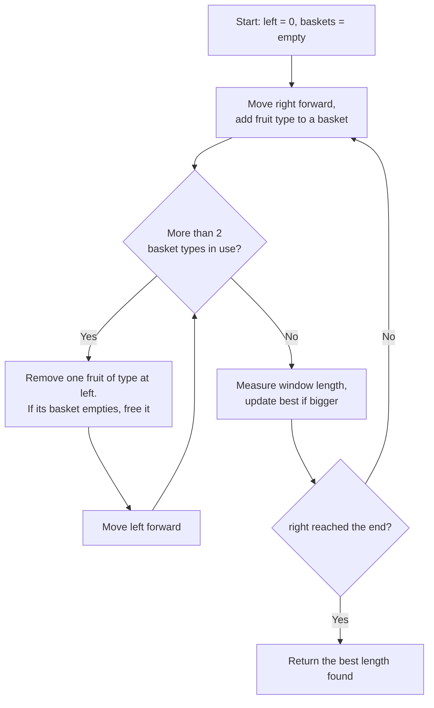

# 904.Fruit Into Baskets — The Two-Basket Harvest

A Java solution to the **Fruit Into Baskets** problem (LeetCode 904), paired with an interactive React visualization that explains the "at most K distinct types" sliding window technique to anyone — technical or not.

**Given a row of fruit trees and exactly 2 baskets (one fruit type per basket), find the most fruit you can collect in one continuous walk.**


**click here 👇**

🔗 **[Try the live visualization](https://gz2s62.csb.app/)**



---

## 📌 Problem Statement

You're walking along a row of fruit trees, where each tree produces one type of fruit. You have exactly **2 baskets**, and **each basket can only hold one type of fruit** (but unlimited quantity of that type). Starting from any tree, walk in one direction, picking one fruit per tree, and stop as soon as you'd need a third basket. Find the **most fruit you can collect**.

**Example**
```
Trees: [1, 2, 1], baskets = 2

Every tree is either type 1 or type 2 — only 2 types total,
so you can pick from the whole row.

Answer: 3
```
---

## 🔄 Algorithm Flow



---

**Complexity**
- Time: `O(n)` — `right` moves forward `n` times total, and `left` also moves forward at most `n` times total across the whole run.
- Space: `O(1)` extra — the basket map holds at most 3 entries at any moment (2 valid + 1 about to be evicted).

---

```
---

## ✅ Why This Approach Works

- The window **only ever shrinks as much as needed** — as soon as it's back down to 2 basket types, it's safe to stop and keep expanding.
- Because `left` only ever moves forward, the total shrink work across the whole run is capped at `n`, keeping the algorithm linear.
- Measuring the window length after *every* expansion (not just when hitting exactly 2 types) correctly captures runs that start with only 1 fruit type too.
