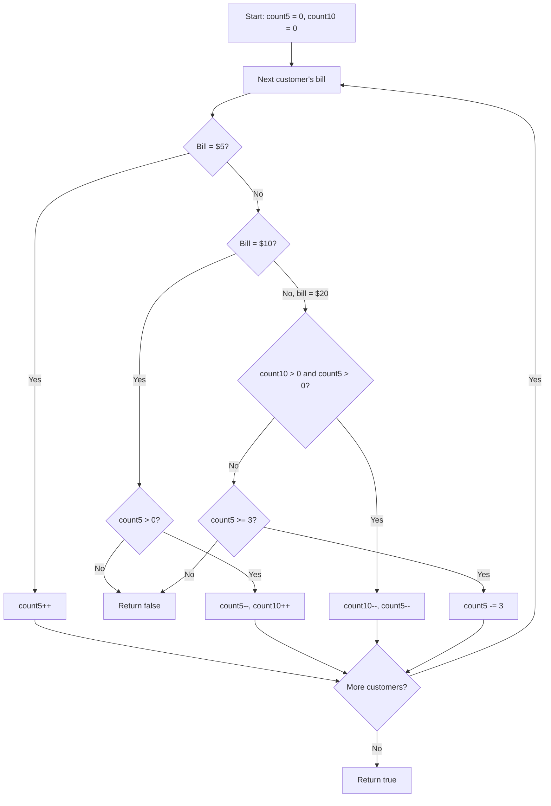

# Lemonade Change — The Cash Register

A Java solution to the **Lemonade Change** problem, paired with an interactive React visualization that explains the greedy algorithm to anyone — technical or not.

**Each lemonade costs $5. Customers pay with a $5, $10, or $20 bill, one at a time. Can you always give correct change?**

**click here 👇**

🔗 **[Try the live visualization](https://xddv5x.csb.app/)**


---

## 📌 Problem Statement

You're running a lemonade stand where every drink costs **$5**. Customers arrive one at a time, each paying with a **$5, $10, or $20** bill. You start with **no change in the register**. For every customer, you must give back the correct change (or none, if they paid exactly $5) using only the bills you've collected so far. Determine whether you can serve **every** customer successfully.

**Example**
```
Bills: [5, 5, 10, 10, 20]

Customer 1 pays $5  → register: 1×$5
Customer 2 pays $5  → register: 2×$5
Customer 3 pays $10 → give back one $5 → register: 1×$5, 1×$10
Customer 4 pays $10 → give back one $5 → register: 0×$5, 2×$10
Customer 5 pays $20 → needs $15 change, but there's no $5 left
                       and only 0 fives (need 3+) → FAIL

Answer: false
```


## 🧠 Core Idea

1. Keep a running count of how many **$5** and **$10** notes are currently in the register.
2. For each customer's bill:
   - **$5** → just add it to the register.
   - **$10** → give back one $5 (fail if you don't have one).
   - **$20** → prefer giving one $10 + one $5; if that's not possible, try giving three $5s instead; if neither works, fail.
3. If every customer gets correct change, the day is a success.

This is a **greedy algorithm**: at every $20 payment, always breaking a $10 first (rather than three $5s) is provably optimal, because $5 notes are strictly more useful to keep in reserve — they're needed for *both* $10 and $20 payments, while $10 notes are only useful for the $10+$5 combo.

---

## 🔄 Algorithm Flow



---


**Complexity**
- Time: `O(n)` — each customer is processed exactly once, with only constant-time work per customer.
- Space: `O(1)` extra — just two running counters, no matter how many customers there are.

---

## ✅ Why This Approach Works

- **Greedy choice property:** always preferring a $10+$5 combo over three $5s for a $20 payment never makes things worse later, because a $5 note can always substitute for part of a future $10-or-$20 payment, while a $10 note is far less flexible.
- Because the choice at each customer only depends on the current register counts (not on any future bills), no backtracking is ever needed — a single forward pass is enough.
- The algorithm fails fast: the moment correct change becomes impossible, there's no way to recover, so returning `false` immediately is correct.
