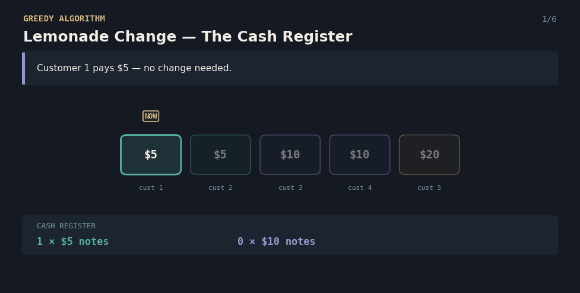
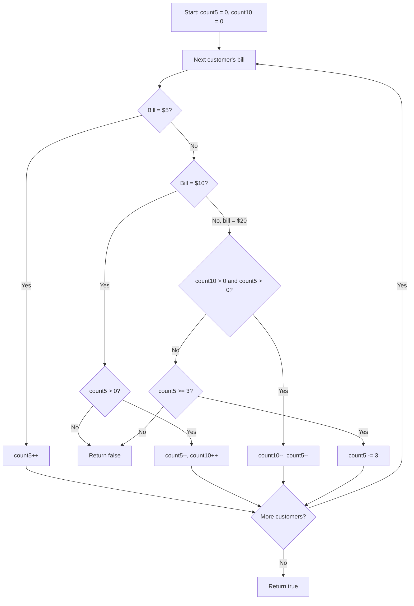

# Lemonade Change — The Cash Register

A Java solution to the **Lemonade Change** problem, paired with an interactive React visualization that explains the greedy algorithm to anyone — technical or not.

**Each lemonade costs $5. Customers pay with a $5, $10, or $20 bill, one at a time. Can you always give correct change?**



---

## 📌 Problem Statement

You're running a lemonade stand where every drink costs **$5**. Customers arrive one at a time, each paying with a **$5, $10, or $20** bill. You start with **no change in the register**. For every customer, you must give back the correct change (or none, if they paid exactly $5) using only the bills you've collected so far. Determine whether you can serve **every** customer successfully.

**Example**
```
Bills: [5, 5, 10, 10, 20]

Customer 1 pays $5  → register: 1×$5
Customer 2 pays $5  → register: 2×$5
Customer 3 pays $10 → give back one $5 → register: 1×$5, 1×$10
Customer 4 pays $10 → give back one $5 → register: 0×$5, 2×$10
Customer 5 pays $20 → needs $15 change, but there's no $5 left
                       and only 0 fives (need 3+) → FAIL

Answer: false
```

---

## 💡 Real-Life Analogy

You're standing behind a lemonade stand with a **cash register that only holds $5 and $10 notes** (you never hand out $20s as change, so they're not worth tracking).

Each customer hands you a bill:
- **$5** → straight into the register, no change owed.
- **$10** → you owe them **$5 back**. If you don't have a $5 note, you're stuck.
- **$20** → you owe them **$15 back**. You have two ways to make that: one $10 + one $5, or three $5s. You always prefer the **$10 + $5 combo first**, because $5 notes are more flexible — they're the *only* way to make change for a $10, so you want to hang onto as many of them as possible.

If you ever can't make correct change, you have to turn a customer away — and the whole day is a failure.

---

## 🧠 Core Idea

1. Keep a running count of how many **$5** and **$10** notes are currently in the register.
2. For each customer's bill:
   - **$5** → just add it to the register.
   - **$10** → give back one $5 (fail if you don't have one).
   - **$20** → prefer giving one $10 + one $5; if that's not possible, try giving three $5s instead; if neither works, fail.
3. If every customer gets correct change, the day is a success.

This is a **greedy algorithm**: at every $20 payment, always breaking a $10 first (rather than three $5s) is provably optimal, because $5 notes are strictly more useful to keep in reserve — they're needed for *both* $10 and $20 payments, while $10 notes are only useful for the $10+$5 combo.

---

## 🔄 Algorithm Flow



---

## 💻 The Java Solution

```java
package lemonade_change_860;
public class Solution {
    public static boolean lemonadeChange(int[] bills) {
        // Hamare paas kitne $5 aur $10 ke notes hain
        int count5 = 0;
        int count10 = 0;
        // Har customer ko ek-ek karke handle karenge
        for (int i = 0; i < bills.length; i++) {
            // Agar customer ne $5 diya
            // Change dena nahi padega, bas note rakh lo
            if (bills[i] == 5) {
                count5++;
            }
            // Agar customer ne $10 diya
            else if (bills[i] == 10) {
                // $10 ke liye $5 ka change dena zaroori hai
                if (count5 == 0)
                    return false;
                // Ek $5 de diya aur ek $10 mil gaya
                count5--;
                count10++;
            }
            // Agar customer ne $20 diya
            else {
                // Sabse best option:
                // 1 x $10 + 1 x $5 ka change do
                // Kyunki future ke liye $5 bachana important hai
                if (count10 > 0 && count5 > 0) {
                    count10--;
                    count5--;
                }
                // Agar $10 nahi hai to 3 x $5 de do
                else if (count5 >= 3) {
                    count5 -= 3;
                }
                // Kisi bhi tarike se change nahi de paaye
                else {
                    return false;
                }
            }
        }
        // Sab customers ko successfully change mil gaya
        return true;
    }
    public static void main(String[] args) {
        int[] arr = {5, 5, 10, 10, 20};
        boolean result = lemonadeChange(arr);
        System.out.println(result);
    }
}
```

**Complexity**
- Time: `O(n)` — each customer is processed exactly once, with only constant-time work per customer.
- Space: `O(1)` extra — just two running counters, no matter how many customers there are.

---

## 🎬 Interactive version

`LemonadeChangeVisualizer.jsx` renders the algorithm as a queue of customers handing over bills, with a live cash register panel tracking your $5 and $10 notes, the change given animated for every transaction, and a final true/false verdict.

**Features**
- Type in your own sequence of $5/$10/$20 bills, or hit the shuffle icon for a random example
- Step forward / backward, or press play to auto-advance
- Watch the register update live and see exactly which notes are handed back as change
- A clear ✓ true / ✗ false verdict at the end — and the walk stops immediately the moment change can't be made, just like the real algorithm

**Run it locally**
```bash
npm install lucide-react
```
```jsx
import LemonadeChangeVisualizer from "./LemonadeChangeVisualizer";

export default function App() {
  return <LemonadeChangeVisualizer />;
}
```

A ready-to-run CodeSandbox project (with `package.json`, `index.html`, `index.js`, `App.js` already wired up) is included as `lemonade-change-sandbox.zip` — unzip it, `npm install`, `npm start`, and it runs immediately.

---

## ✅ Why This Approach Works

- **Greedy choice property:** always preferring a $10+$5 combo over three $5s for a $20 payment never makes things worse later, because a $5 note can always substitute for part of a future $10-or-$20 payment, while a $10 note is far less flexible.
- Because the choice at each customer only depends on the current register counts (not on any future bills), no backtracking is ever needed — a single forward pass is enough.
- The algorithm fails fast: the moment correct change becomes impossible, there's no way to recover, so returning `false` immediately is correct.
