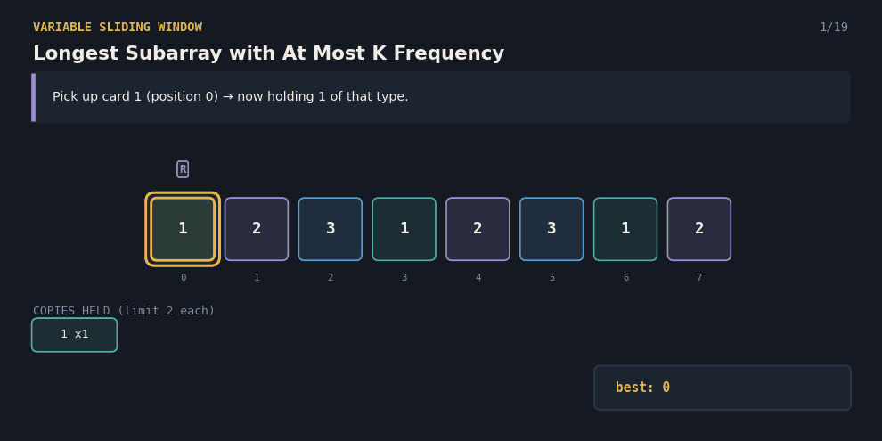
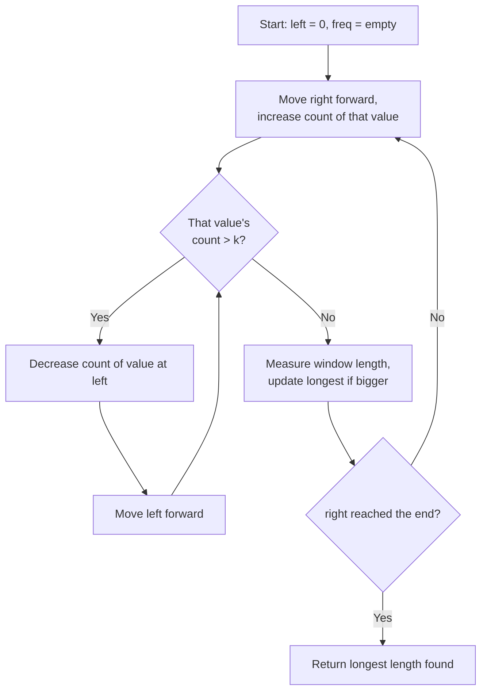

# 2958.Longest Subarray with At Most K Frequency — The Card Collection

A Java solution to the **Length of Longest Subarray with at most K Frequency** problem (LeetCode 2958), paired with an interactive React visualization that explains the variable-size sliding window technique to anyone — technical or not.

**Given a list of numbers and a limit `k`, find the longest continuous stretch where no single value appears more than `k` times.**



---

## 📌 Problem Statement

You're given an array of numbers and a number `k`. Find the length of the **longest contiguous subarray** where **no value appears more than `k` times**.

**Example**
```
Array: [1, 2, 3, 1, 2, 3, 1, 2], k = 2

Longest stretch where every value appears at most twice: indices 2..7
3, 1, 2, 3, 1, 2 → 1 appears 2x, 2 appears 2x, 3 appears 2x

Answer: 6
```

---

## 💡 Real-Life Analogy

Imagine walking along a shelf of **collectible trading cards**, picking one up at each position. You're allowed to hold **at most `k` copies of any single card type** at once — no more.

You walk forward, adding each card to your hand. The moment a card type would exceed your limit of `k` copies, you have to **release cards from the earliest part of your current stretch** — not just copies of that type, but literally the oldest cards in your hand — until that type's count drops back to `k` or fewer. Throughout the walk, you track the **longest continuous stretch of cards you were ever able to hold at once**.

---

## 🧠 Core Idea

1. Use **two pointers**, `left` and `right`, and a running count of how many times each value currently appears in the window.
2. **Expand** the window by moving `right` forward, increasing the count for that value.
3. If that value's count goes **above `k`**, **shrink from the left** — decreasing the count of the value at `left` each time — until the count is back to `k` or fewer.
4. After every expansion (and any needed shrinking), the window is valid, so **measure its length and keep the largest one seen**.
5. Continue until `right` reaches the end of the array.

Just like "Fruit Into Baskets," this is an **"at most"** style window — every valid window counts toward the answer, not just ones that hit the limit exactly.

---

## 🔄 Algorithm Flow




**Complexity**
- Time: `O(n)` — `right` moves forward `n` times total, and `left` also moves forward at most `n` times total across the whole run.
- Space: `O(n)` in the worst case for the frequency table (one entry per distinct value).

---

## ✅ Why This Approach Works

- The window **only ever shrinks as far as the violation requires** — as soon as the offending value's count drops back to `k` or fewer, it's safe to stop and keep expanding.
- Because `left` only ever moves forward, the total shrink work across the whole run is capped at `n`, keeping the algorithm linear.
- Measuring the window length after every valid expansion (not just when a limit is exactly hit) correctly captures every valid stretch, including ones where no value even comes close to the limit.
