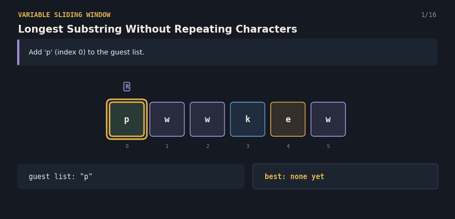
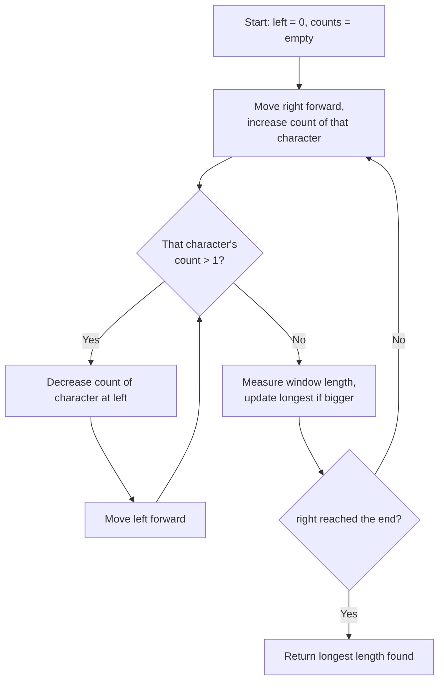

# 3.Longest Substring Without Repeating Characters — The Guest List

A Java solution to the **Longest Substring Without Repeating Characters** problem, paired with an interactive React visualization that explains the sliding window technique to anyone — technical or not.

**Given a string, find the length of the longest continuous stretch where no character repeats.**

**click here 👇**

🔗 **[Try the live visualization](https://xxnxsz.csb.app/)**



---

## 📌 Problem Statement

You're given a string `s`. Find the length of the **longest contiguous substring** where **every character is unique** — no repeats allowed.

**Example**
```
String: "pwwkew"

Longest substring with no repeats: "wke" (indices 2..4)

Answer: 3
```

---

## 💡 Real-Life Analogy

Picture yourself managing a **guest list at the door of a party**. Guests arrive one at a time, in a fixed order, and you add each one to your current list.

The moment someone arrives whose name is **already on the list**, you have a problem — no duplicate names allowed. So you start **removing guests from the front of the list** (the ones who arrived earliest), one at a time, until the duplicate name is gone. Then the new guest joins in. Throughout the whole process, you keep track of the **longest guest list you ever had** with no duplicate names.

---

## 🧠 Core Idea

1. Use **two pointers**, `left` and `right`, and a running count of how many times each character currently appears in the window.
2. **Expand** the window by moving `right` forward, adding the new character to the count.
3. If that character's count goes **above 1** (a repeat), **shrink from the left** — removing the character at `left` from the count each time — until the repeat is resolved (count back down to 1).
4. After every expansion (and any needed shrinking), the window has no repeats, so **measure its length and keep the largest one seen**.
5. Continue until `right` reaches the end of the string.

Because `left` only ever moves forward and the shrinking always targets the exact duplicate, every character is looked at a small, bounded number of times — no need to restart the scan from scratch on every repeat.

---

## 🔄 Algorithm Flow



---


**Complexity**
- Time: `O(n)` — `right` moves forward `n` times total, and `left` also moves forward at most `n` times total across the whole run.
- Space: `O(min(n, alphabet size))` for the character-count map.

---


## ✅ Why This Approach Works

- The window **only ever shrinks as far as the duplicate requires** — once the repeated character's count drops back to 1, it's safe to stop and keep expanding.
- Because `left` only ever moves forward, the total shrink work across the whole run is capped at `n`, keeping the algorithm linear.
- Measuring the window length after every valid expansion guarantees the true longest unique stretch is found, without ever needing to re-scan earlier parts of the string.
