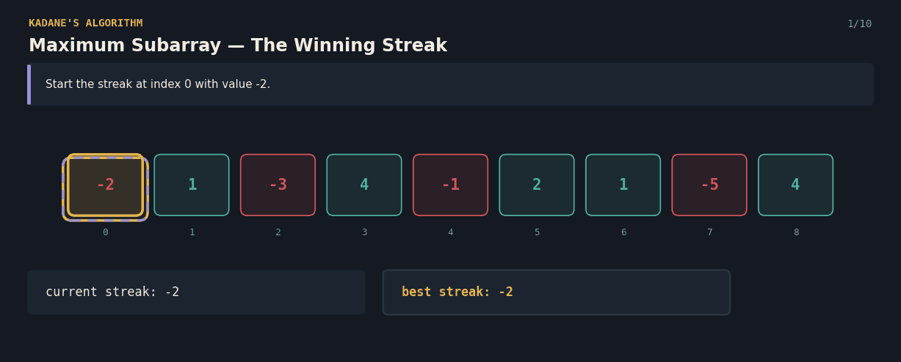
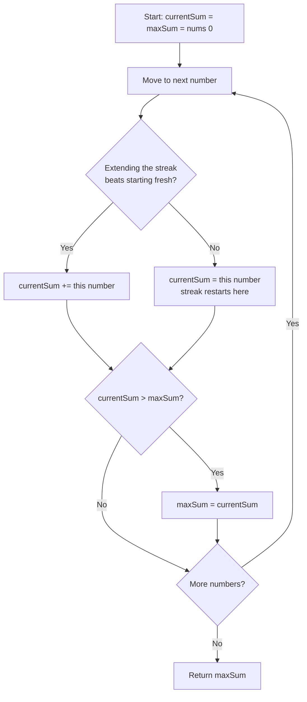

# 53 Maximum Subarray (Kadane's Algorithm) — The Winning Streak

A Java solution to the classic **Maximum Subarray** problem using **Kadane's Algorithm**, paired with an interactive React visualization that explains the technique to anyone — technical or not.

**Given a list of numbers (positive and negative), find the contiguous stretch with the largest possible sum.**

**click here 👇**

🔗 **[Try the live visualization](https://5kvrvj.csb.app/)**



---

## 📌 Problem Statement

You're given a list of numbers that can be positive, negative, or zero. Find the **contiguous subarray** (a stretch of neighbouring numbers) whose sum is the **largest possible**.

**Example**
```
Array: [-2, 1, -3, 4, -1, 2, 1, -5, 4]

Best contiguous stretch: [4, -1, 2, 1] (indices 3..6)
Sum: 4 + (-1) + 2 + 1 = 6

Answer: 6
```

---

## 💡 Real-Life Analogy

Imagine tracking your **poker winnings night after night**. Each night has a result — you either win money or lose some. You're trying to find the best possible **winning streak** across the whole run: the stretch of consecutive nights that nets you the most money.

Every night, you make one decision: *do I keep riding my current streak (add tonight's result to my running total), or has my running total gotten so bad that I'm better off cutting my losses and starting a brand-new streak from tonight alone?* You always pick whichever gives you more. Along the way, you keep a separate note of the **best streak total you've ever had**, in case your current streak never beats it again.

---

## 🧠 Core Idea

1. Start by assuming the best streak so far is just the very first number.
2. Walk through the rest of the numbers one at a time.
3. At each number, decide: **extend the current streak** (add this number to the running total), or **restart the streak** from this number alone — whichever gives a bigger running total.
4. Compare the (possibly new) running total to the best total ever recorded, and update the record if this is a new high.
5. After the walk, the record is the answer.

This is the essence of **Kadane's Algorithm** — the best answer ending at each position depends only on the best answer ending at the previous position, so a single forward pass is enough; there's no need to re-scan everything from scratch.

---

## 🔄 Algorithm Flow



---

## 💻 The Java Solution


**Complexity**
- Time: `O(n)` — every number is visited exactly once, with only constant-time work per number.
- Space: `O(1)` extra — just two running values (`currentSum` and `maxSum`), no matter how long the array is.

---

---

## ✅ Why This Approach Works

- **Optimal substructure:** the best subarray ending exactly at position `i` is either "the best subarray ending at `i-1`, extended by one" or "just `nums[i]` on its own" — there's no third option, since any other subarray ending at `i` would have to skip over some earlier element, which is impossible in a *contiguous* subarray.
- Because each decision only depends on the immediately preceding running total (not the whole history), a single forward pass is enough — no backtracking or re-computation needed.
- Tracking `maxSum` separately from `currentSum` correctly handles cases where the best streak occurred earlier and was never beaten again — the running total is allowed to end lower than the historical best.
