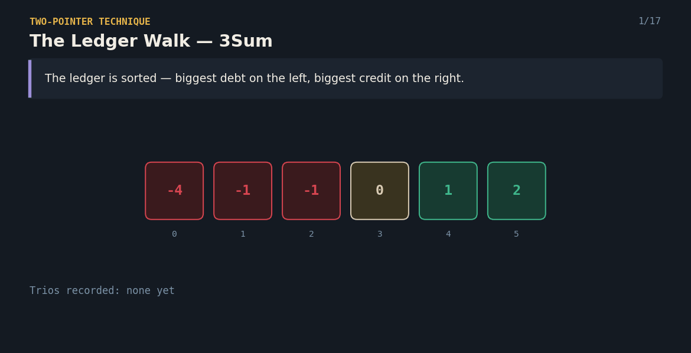

# 3Sum — The Ledger Walk

A Java solution to the classic **3Sum** problem, paired with an interactive React visualization that explains the two-pointer technique to anyone — technical or not.

**click here 👇**

🔗 **[Try the live visualization](https://7kcxsf.csb.app/)**



---

## 📌 Problem Statement

You are given a list of numbers (some negative, some positive, some zero).
Find every unique group of **3 numbers** from that list which add up to exactly **0**. No group should repeat.

**Example**
```
Input:  [-1, 0, 1, 2, -1, -4]
Output: [[-1, -1, 2], [-1, 0, 1]]
```

---

**Complexity**
- Time: `O(n²)` — sorting is `O(n log n)`, and the anchor loop combined with the two-pointer sweep is `O(n²)`.
- Space: `O(1)` extra (excluding the output list).

---

**Features**
- Type in your own array (comma-separated) or hit the shuffle icon for a random example
- Step forward / backward, or press play to auto-advance
- Live "Low + High = sum, need target" readout
- Running list of every trio found so far

## ✅ Why This Approach Works

- **Sorting first** means once a sum is "too small" or "too big," you know exactly which direction to move — no guessing.
- **Skipping duplicate anchors and duplicate scout positions** guarantees every trio in the answer is unique, without extra bookkeeping.
- The two-scout walk eliminates large chunks of wrong combinations in a single step, instead of checking every possible group of three.
